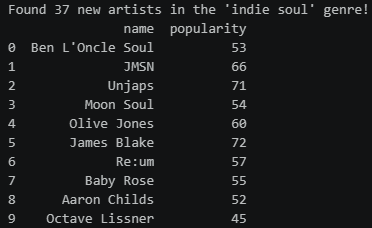
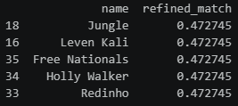

# Musical DNA: Content-based recommender
An unsupervised machine learning pipeline that transforms Spotify streaming history into a high-dimensional "taste profile" to discover underground hidden gems.
Live demo: [My Musical DNA Explorer](https://musicrecommendersystem-6mvtamxjtkkkeuhrjpgqm6.streamlit.app/)

## The mission
Instead of relying on what's "trending" globally, this tool uses **cosine similarity** and **feature scaling** to find artists that **mathematically match your specific listening habits**. It specifically focuses on finding "Hidden Gems"—artists with high personal compatibility but low global popularity.

## How it works
- **Data processing**: cleans and normalizes raw Spotify JSON streams.
- **Feature engineering**: utilizes `MultiLabelBinarizer` to transform genre lists into a 491-dimensional vector matrix.
- **Normalization**: applies `MinMaxScaler` to listening time so play frequency doesn't drown out genre variety.
- **The "taste profile"**: calculates a **user centroid** (the average of your top artists) to act as a mathematical "North Star."
- **Inference engine**: uses **cosine similarity** to rank new artists based on the angle of their genre DNA relative to your profile.

## The ML model: non-parametric & memory-based
Unlike supervised models (like Neural Networks) that "condense" data into fixed weights, this project utilizes an **instance-based** learning approach.
- **Non-parametric**: the model doesn't assume a fixed shape for your musical taste (like a linear formula). Instead, it allows the complexity of the "musical DNA" to be defined entirely by the data itself.
- **Memory-based (batch processed)**: the system uses the entire "memory" of the provided JSON export (1,525 artists) to calculate similarities. The "intelligence" of the recommender is stored directly in the distribution of these data points across the 491-dimensional space.
- **Lazy learning**: technically, this is a "lazy learner" algorithm. It doesn't have a separate training phase; instead, it waits until you query a specific artist or genre to perform the mathematical comparisons.

## Installation & setup
Clone the repo:
```bash
git clone https://github.com/your-username/musical-dna.git
```

Install dependencies:
```bash
pip install pandas scikit-learn spotipy python-dotenv
```

Environment variables:
Create a .env file in the root directory to store your Spotify API credentials:
```bash
SPOTIPY_CLIENT_ID='your_id_here'
SPOTIPY_CLIENT_SECRET='your_secret_here'
```

## Key technologies
- Pandas: for data manipulation and cleaning.
- Scikit-Learn: for MinMaxScaler, MultiLabelBinarizer, and Cosine Similarity.
- Spotipy: to enrich the local history with global Spotify genre and popularity data.
- Python-Dotenv: for secure credential management.

## Results
The system successfully navigated the "cold-start" problem, identifying artists with zero historical presence in my library that mathematically align with my taste profile.

**The discovery pipeline**:
- API Extraction: the "discovery engine" retrieved 37 new artists from the Spotify API within the Indie Soul genre.
- Popularity filtering: potential candidates were filtered to prioritize "hidden gems" (global popularity < 50).
- Vector alignment: candidates were scored against the user taste profile.

**The "focus lens" effect**

 


By shifting the model from a global average to a refined taste profile (averaging only the Top 10 artists), the recommendation confidence nearly doubled:
| Profile Type | Average Match Score | Alignment Level |
| :--- | :---: | :--- |
| **Global Profile** (1,525 Artists) | ~0.24 | Broad Stylistic Match |
| **Refined Profile** (Top 10 Artists) | **~0.47** | **High-Intent Match** |

## License
This project is licensed under the **MIT License**. See the [LICENSE](LICENSE) file for more information.
